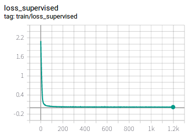
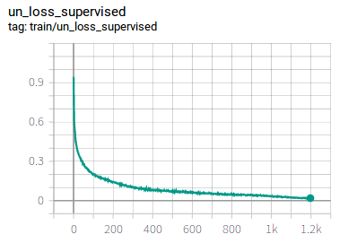
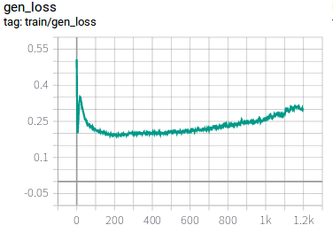

# ImproveGan-pytorch
Improved Techniques for Training GANs for cifar10 dataset  
This is an implementation of Semi-supervised generative adversarial network in the paper Improved Techniques for Training GANs for cifar10 dataset.  
# Related  
Origin paper:https://arxiv.org/abs/1606.03498  
Official Implementation(Theano):https://github.com/openai/improved-gan  
# Requirement  
python3.5  
pytorch 1.1.0  
cuda8.0  
torchvision  
# Run
python3 train.py  
Default Set:config.py
# Result  
Test best acc:**79.64%** .Achieve the accuracy of the original paper.
# loss curve  

# Train process of Gen img  

